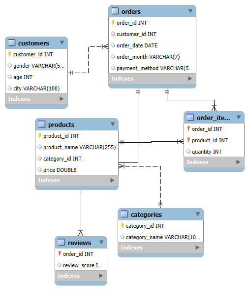
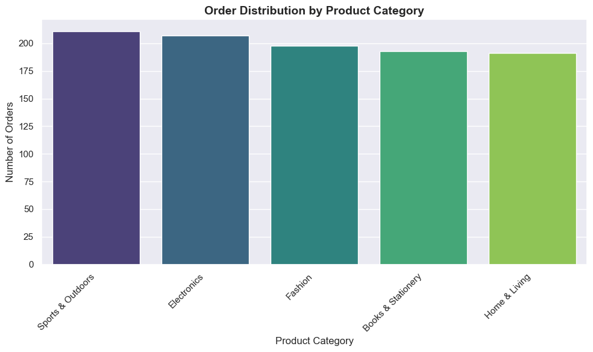
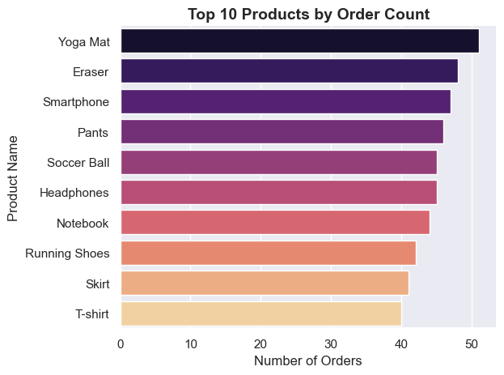
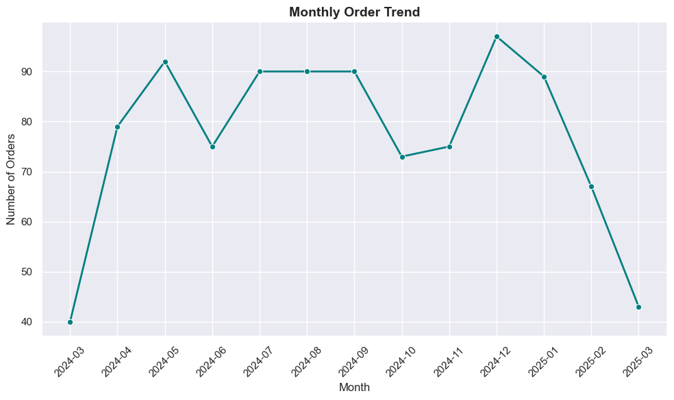

# E-Commerce Data Analysis using SQL

## Project Overview
This project focuses on analyzing an e-commerce dataset using **SQL as the primary analytical tool**.
The objective was to design a **normalized relational database** from raw transactional data and answer
key business questions related to revenue, products, customers, and geographic performance.

Python was used only for **data cleaning and exploratory analysis**, while all core insights were derived using SQL.

---

## Dataset
- Synthetic online retail dataset
- ~1000 transactional records
- Each row represents a single product purchase
- Includes customer, product, category, order, and review information

The raw dataset is stored in the `data/` folder.

---

## Tools & Technologies
- **MySQL**
  - Database schema design and normalization
  - Data insertion and analytical SQL queries
- **Python (Pandas)**
  - Data cleaning and preprocessing
  - Exploratory data analysis (EDA)
- **Seaborn / Matplotlib**
  - Basic visualizations to understand data distribution and trends

---

## Project Focus
This is a **SQL-first analytics project**.
All business logic and insights were derived using SQL queries.
Python was intentionally limited to preprocessing and early exploration.

---

## Data Preparation
Initial data cleaning and preprocessing were performed using Python (Pandas).  
This included:
- Handling missing values (e.g., gender, review scores)
- Converting date columns to proper datetime formats
- Basic exploratory analysis and visual validation

The cleaned data was then **loaded into MySQL** and used to populate normalized relational tables.
The cleaned dataset itself is not stored separately; the cleaning process is fully reproducible via the Python notebook.

---

## Data Modeling & Normalization
The raw transactional data was transformed into a **normalized relational schema** to reduce redundancy
and enable accurate analysis.

The schema consists of:
- Customers
- Orders
- Order Items
- Products
- Categories
- Reviews

Primary and foreign key relationships were explicitly defined to model real-world e-commerce behavior.

### Entity Relationship Diagram (ERD)
The ER diagram below illustrates the final database design:



---

## Exploratory Visualizations (Python)
Basic exploratory visualizations were created during the Python phase to understand the data before SQL analysis.

Examples include:
- Category-wise order distribution
- Top products by order count
- Monthly order trends

Sample visualizations:

  
  


---

## Business Questions Answered (SQL)

The following key business questions were answered using SQL:

1. What is the total revenue generated?
2. How does revenue change over time (monthly trend)?
3. What is the average order value (AOV)?
4. Which products generate the most revenue?
5. Which product categories contribute most to revenue?
6. Who are the highest-value customers?
7. Which cities generate the highest revenue?
8. Are customers one-time buyers or repeat buyers?

All analytical queries are available in the `sql/analysis_queries.sql` file.

---

## Key Insights
- Revenue is concentrated among a limited set of products and customers.
- High-volume products contribute more to revenue than high-priced but low-volume items.
- Revenue contribution varies significantly by city.
- All customers in this dataset were **one-time buyers**, highlighting a limitation of the synthetic data.

---

## Project Structure

```

ecommerce-sql-analysis/
│
├── sql/
│ ├── schema.sql
│ ├── data_insertion.sql
│ └── analysis_queries.sql
│
├── python/
│ └── data_cleaning_eda.ipynb
│
├── data/
│ └── synthetic_online_retail_data.csv
│
├── images/
│ ├── er_diagram.png
│ ├── category_order.png
│ ├── top_product.png
│ └── monthly_orders.png
│
├── ppt/
│ └── ecommerce_sql_analysis.pptx
│
└── README.md

```

## Notes & Limitations
- This project uses a synthetic dataset, which limits customer repeat behavior.
- The focus was on **relational modeling and SQL analytics**, not predictive modeling or dashboards.
- SQL scripts are intentionally kept simple and readable rather than optimized for production workloads.

---

## Author
**Shabin P K**

- LinkedIn: https://www.linkedin.com/in/shabinpengad
